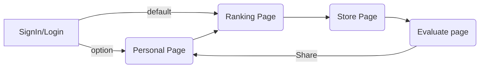

# Basic Flow

# Basic Functions

### Authentication Functions

1. Sign in function **SignIn**
2. Log in function **LogIn**
3. Log out function **LogOut**

### Store Functions

1. Load store's information **LoadStore**
2. Store store's evaluation (use for 1 user) **StoreStoreEvaluation**
3. Compute store's evaluation **ComputeStoreEvaluation**
4. Update store's evaluation **UpdateStoreEvaluation**

### Dishes Functions

1. Store dish's evaluation **StoreDishEvaluation**
2. Compute dish's evaluation **ComputeDishEvaluation**
3. Update dish's evaluation **UpdateDishEvaluation**
4. Load dish's information **LoadDish**

### Ranking Functions

1. Load Ranked Stores **LoadRankedStores**
2. Load Ranked Dishes **LoadRankedDishes**
