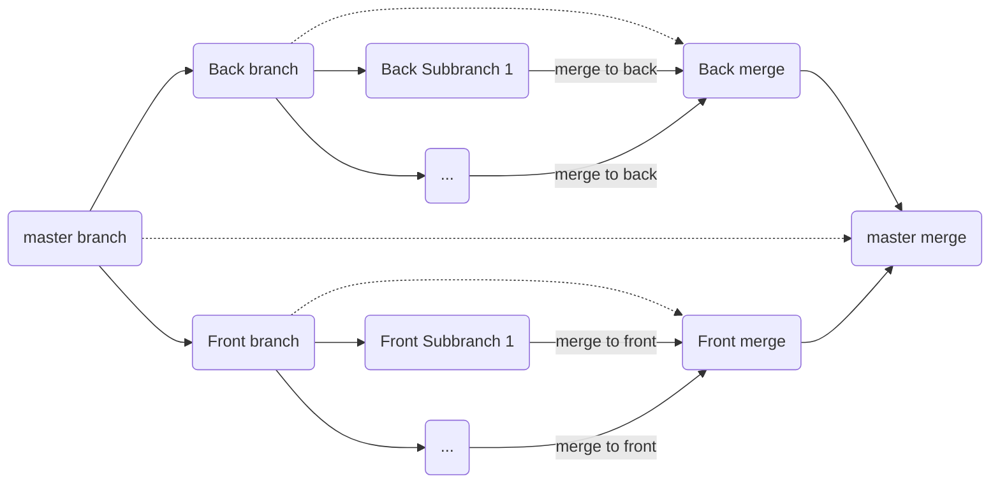

# Dev Flow

# Dev Steps

1. Create new branch (base on diagram)
2. Push branch to origin remote
3. Code a little bit
4. Create pull request (commect issue ex: #3, #123,...)
5. Continue code until done
6. Push new code to branch
7. Merge pull request